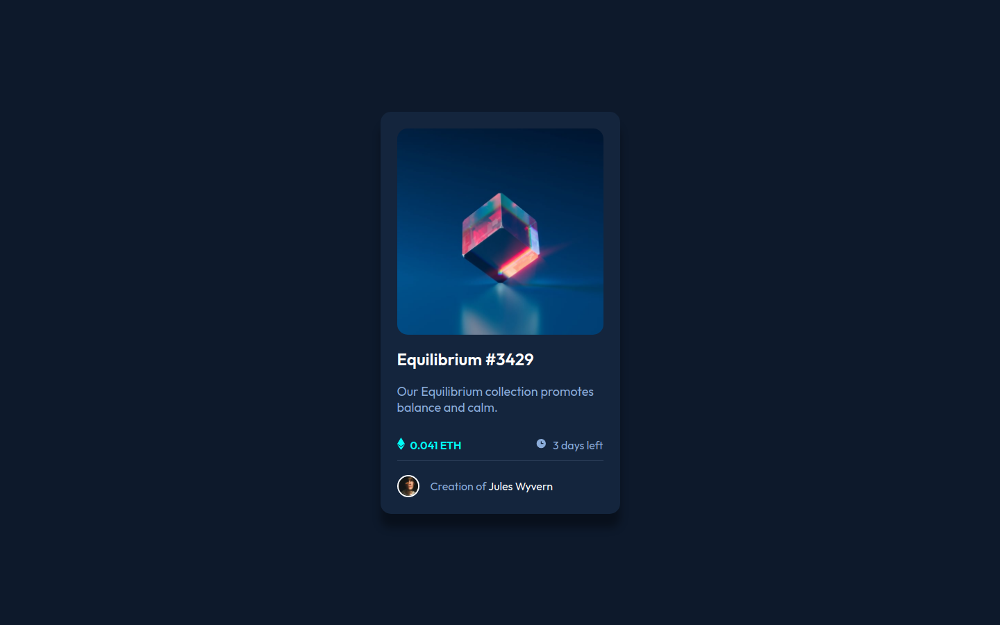
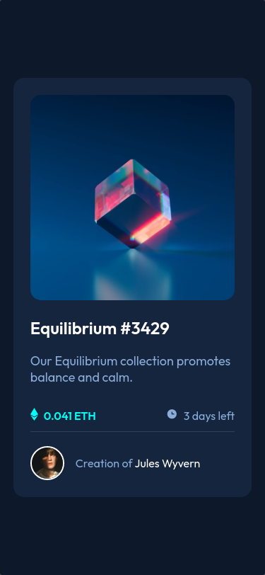

# Frontend Mentor - NFT preview card component solution

This is a solution to the [NFT preview card component challenge on Frontend Mentor](https://www.frontendmentor.io/challenges/nft-preview-card-component-SbdUL_w0U). Frontend Mentor challenges help you improve your coding skills by building realistic projects.

## Overview

### The challenge

Users should be able to

- View the optimal layout depending on their device's screen size
- See hover states for interactive elements

### Screenshot

**Desktop**



**Mobile**

Add a screenshot of your solution. The easiest way to do this is to use Firefox to view your project, right-click the page and select "Take a Screenshot". You can choose either a full-height screenshot or a cropped one based on how long the page is. If it's very long, it might be best to crop it.

### Links

- **STATUS/ON** Live Site URL: [See in real time on vercel](https://nft-card-component-npz4l9cut-henriquessan.vercel.app/)

## My process

### Built with

- Semantic HTML5 markup.
- CSS custom properties.
- SCSS(SASS) custom properties.
- CSS Methodology BEM.
- Flexbox.
- Mobile-first workflow.

### What I learned

```html
<h1>Some HTML code I'm proud of</h1>
```

```css
.proud-of-this-css {
  color: papayawhip;
}
```

```js
const proudOfThisFunc = () => {
  console.log('🎉')
}
```

### Continued development

Use this section to outline areas that you want to continue focusing on in future projects. These could be concepts you're still not completely comfortable with or techniques you found useful that you want to refine and perfect.

### Useful resources

- [Video de como usar o SASS BR](https://www.youtube.com/watch?v=C8KlabGtE8Y) - This helped me for XYZ reason. I really liked this pattern and will use it going forward.
- [CSS Methodology BEM](https://www.youtube.com/watch?v=27JtRAI3QO8) - This is an amazing article which helped me finally understand XYZ. I'd recommend it to anyone still learning this concept.
- [CSS BEM Article methodology](https://css-tricks.com/bem-101/) - This is an amazing article which helped me finally understand XYZ. I'd recommend it to anyone still learning this concept.

## Author

- Linkedin - [Henrique Santos Santana](https://www.linkedin.com/in/henrique-santos-santana/)
- Frontend Mentor - [@HenriqueSSan](https://www.frontendmentor.io/profile/HenriqueSSan)
- Vercel - [HenriqueSSan](https://vercel.com/henriquessan)

## Acknowledgments

This is where you can give a hat tip to anyone who helped you out on this project. Perhaps you worked in a team or got some inspiration from someone else's solution. This is the perfect place to give them some credit.
